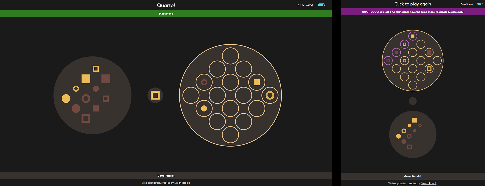

# Quarto - Webgame

Quarto is a board game with 16 stones. Each stone has four attributes. The goal is to place the stone that you receive from your opponent in a row in which all share at least one common attribute. The opponent gets to choose the stone you place each turn.

My implementation allows you to play Quarto against the computer by dragging and dropping the stones to the gameboard. Next to creating a good-looking, intuitive UI, I focused on making the game experience feel real by having the player wait until the computer takes his turn. Having the drag and drop interaction instead of clicking should also make the game feel more real. The visibility of system status was also important for me. The user can always see what the computer is currently doing and what to do exactly when it's the player's turn. I also coded a simple AI which can be activated and lets you only ever "win" in form of a tie.
Check out the game and give it a try:

-> Play: https://www.simonroedig.com/game%20webpage/quarto/index.html
